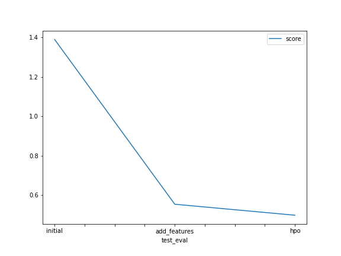

# Report: Predict Bike Sharing Demand with AutoGluon Solution
#### Nelson Guilmaraes

## Initial Training
### What did you realize when you tried to submit your predictions? What changes were needed to the output of the predictor to submit your results?
Need to modify datetime feature in order to extract more information from field

### What was the top ranked model that performed?
WeightedEnsemble_L3

## Exploratory data analysis and feature creation
### What did the exploratory analysis find and how did you add additional features?
Added month, year and hour from datetime

### How much better did your model preform after adding additional features and why do you think that is?
From -114.950726 to -35.139025. The models cannot capture certain information such as ours directly from a string value of the date

## Hyper parameter tuning
### How much better did your model preform after trying different hyper parameters?
There was no improvement

### If you were given more time with this dataset, where do you think you would spend more time?
Try different sets of hyperparameters

### Create a table with the models you ran, the hyperparameters modified, and the kaggle score.
|model|hpo1|hpo2|hpo3|score|
|--|--|--|--|--|
|initial|default|default|default|1.39023|
|add_features|default|default|default|0.47399|
|hpo|'max_base_models': 25|max_base_models_per_type': 5|'save_bag_folds': True| 0.50247|
 
### Create a line plot showing the top model score for the three (or more) training runs during the project.

### Create a line plot showing the top kaggle score for the three (or more) prediction submissions during the project.

TODO: Replace the image below with your own.

## Summary
The exercise shows the importance of feature engineering, the capabilities of AutoML and the challenges with Hyperparameter tuning. The biggest improvement in model performance comes from adding new information to the model, sometimes this new information can be extracted from already existing fields in our data. In this exercise we are supplied with a date field which is just a string field, by tranforming into datetime and creating additional fields (hour, day, month) we add new information to the model. It was interesting to scratch the surface of what AutoGluon can offer. As a DS/MLE it is difficult to keep track of the models and parameters needed to achive a good model performance. At the end, tuning parameters was not an easy task as it is still time consuming and not always produce good results.
